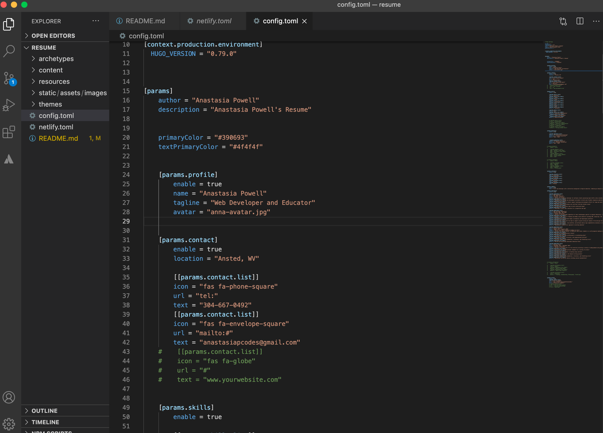
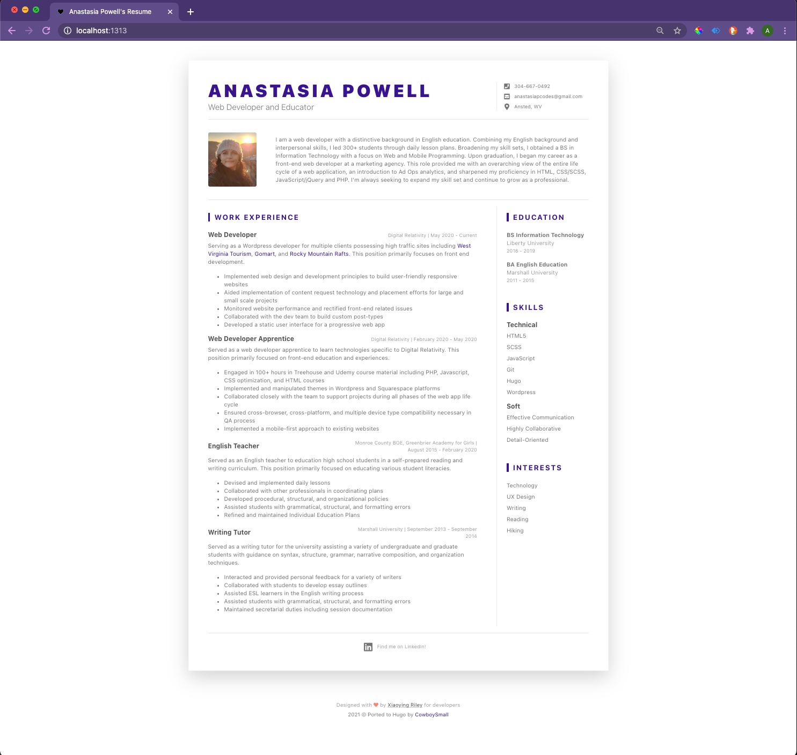
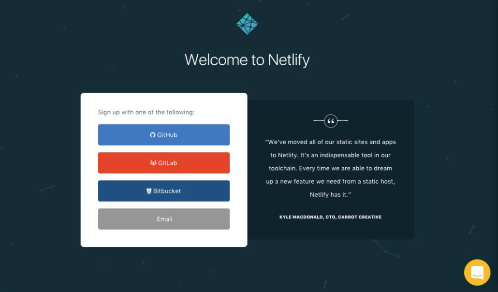
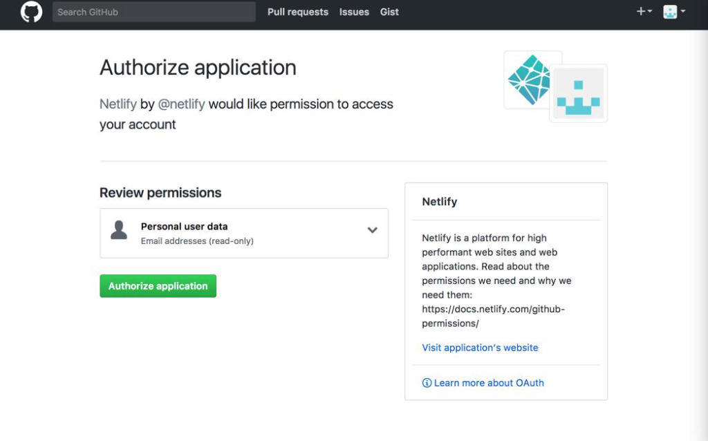
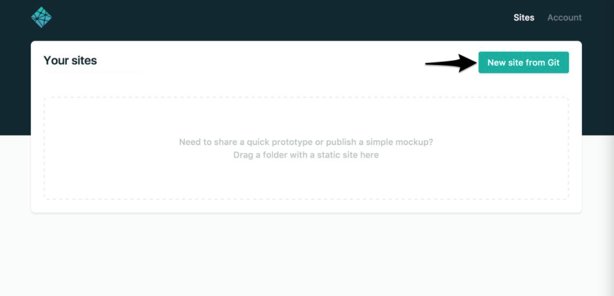
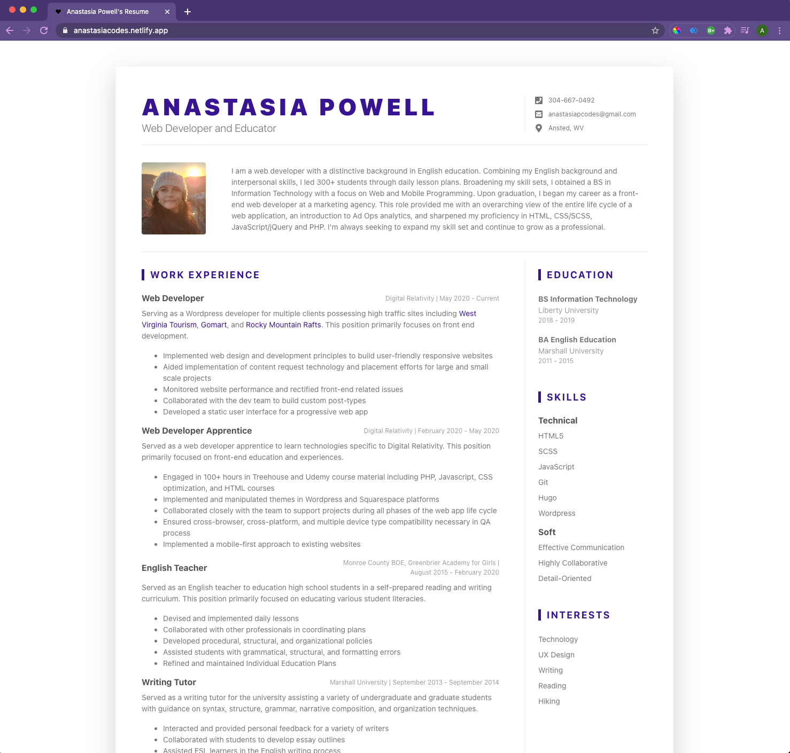

# Anastasia Powell's Resume

## About this project

This project showcases my resume. It was created using a static site generator [Hugo](https://gohugo.io/about) and hosted on [Netlify](https://www.netlify.com/). Continuous integration was setup as indicated with below [Netlify badge](https://docs.netlify.com/monitor-sites/status-badges/).

[](https://app.netlify.com/sites/anastasiacodes/deploys)

### Hugo advantages

* performance
  * branded as the world's fastest static website engine (build times < 1 ms per page)
  * *all* HTML files are rendered on your computer
  
* secure
  * third-party components are not allowed to mount directories
  * utilizes Go Modules to manage dependencies with cryptographic checksums
  * Markdown is defaulted to escape potentially unsafe content

### Netlify advantages

* performance
  * scalable environments allows for 99.9% SLA
  * pre-built files served over CDN
  * build hooks allow both granular control and programmatic control of site
* secure
  * [SOC-2 certified](https://www.imperva.com/learn/data-security/soc-2-compliance)
  * [Jamstack](https://jamstack.org/) architecture abstracts microservice APIs
* continuous deployment
  * run build commands and deploy results to CDN when pushed to centralized repository on GitHub, GitLab, or Bitbucket
  * visual representation of site's status displayed in README via status badges
* custom domains & DNS
  * private domain name registration automatically configured to use Netlify DNS
  * allowance for external domains or utilize Netlify default subdomain

## Installations

Before beginning the project, Hugo must be installed. I installed Hugo on a Mac via [Homebrew](https://brew.sh/):

```zsh
brew install hugo
```

## Create a new Hugo site

Within the root of your Hugo project, use the following command `hugo new site` followed by the title of your site.

```zsh
hugo new site resume
```

If successful, Hugo creates a [directory structure](https://gohugo.io/getting-started/directory-structure/) with the following elements: archetypes, content, data, layouts, static, themes, and config.toml.

## Add a theme

If you do not want to build your own theme, you can access one of [Hugo's free themes](https://themes.gohugo.io/). I choose [DevResume](https://themes.gohugo.io/hugo-devresume-theme/) as my theme.

Clone the repo of the theme into your theme folder.

```zsh
git clone https://github.com/cowboysmall-tools/hugo-devresume-theme.git 
```

Open `config.toml` file and add your theme:

```zsh
theme = "hugo-devresume-theme"
```

Run the Hugo server to check to make sure your theme is installed on your site.

```zsh
hugo server
```

Open `localhost:1313` in a browser and view your website.

## Create content

This project is a-typical to most Hugo websites as content is typically created in the content folder.  

However, as directed in the theme [README](https://github.com/cowboysmall-tools/hugo-devresume-theme/blob/master/README.md), you will simply copy the `config.toml` to the root of your site.

Change the `config.toml` input to match your resume input.



Open `localhost:1313` in a browser to view your updated website.



You have successfully created a static website and are now ready to set up hosting. There are many options for hosting services, as indicated in [Hugo documentation](https://gohugo.io/hosting-and-deployment/), but for this project, I choose to host on Netlify.

## Host Hugo site on Netlify

Before utilizing Netlify's services, you must create an account on [Netlify](https://app.netlify.com/signup). I signed up for a free version via GitHub.



Setup is extremely straightforward and you can deploy your site in minutes.

## Create a new site with continuous deployment

Begin by providing Netlify with authorization to access your version control system account.



You can now synch your project's repository for continuous development.

Select `New site from Git` button.



Continue to follow Netlify prompts to provide Netlify with permission to access your individual repositories.

Before building your site, Netlify needs 3 sets of instructions:

1. Branch to deploy: `main`
2. Build command: `hugo`
3. Publish directory `public`

Select `deploy site` button to build your site on Netlify.

After the terminal view of the build, you should receive a success message providing you will the URL to your website.

You are now hosting a static site on Netlify.


